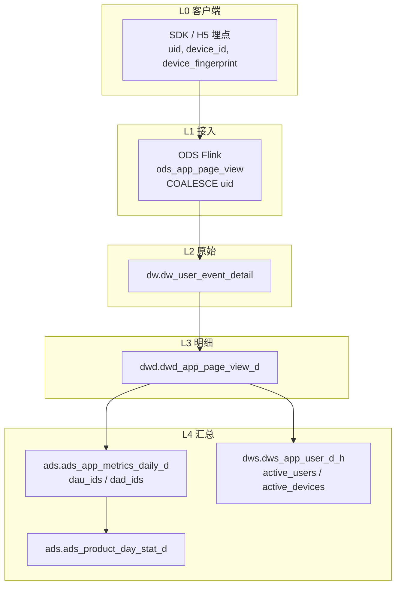

# 逐层核验剧本（Layered Datacheck）

## 1. 适用场景

- 汇总指标异常（如 DAU:DAD 比例失真、留存>100%、金额对不上）
- 不确定是 **ETL 算错** 还是 **源数据/埋点问题**
- 用户要求「查到具体哪一层、哪个字段、哪段 SQL」

## 2. 原则

1. **从消费层往下游→上游走**，不要跳过层。
2. 每层至少核对：**行数/PV、distinct 主键、分段（anon vs logged_in）**。
3. 上一层与下一层差异必须能解释（过滤条件、JOIN、聚合）。
4. **原始层** 以 `dw.dw_user_event_detail` 为准（`event_time` 必带范围）。
5. uid 有效性统一用：`uid IS NOT NULL AND TRIM(uid) <> ''`（**不要用 `uid IS NOT NULL`  alone**）。
6. 设备标识优先级讨论：`device_fingerprint`（较稳）> 登录态 `device_id` > 匿名 raw `device_id`（高 churn）。

## 3. 标准层级链（app 活跃 / DAU / DAD）



## 4. 核查步骤（以 DAU/DAD 为例）

### Step 0：锁定参数
- `dt`, `app_id`, 指标名（dau / dad / active_users / active_devices）

### Step 1：消费层 ADS
```sql
SELECT dt, app_id,
  BITMAP_COUNT(dau_ids) AS dau,
  BITMAP_COUNT(dad_ids) AS dad
FROM ads.ads_app_metrics_daily_d
WHERE dt='@{dt}' AND app_id='@{app_id}';
```
对照程序：`ops_system/05.ads/job_ads_app_metrics_daily_d/ads_app_metrics_daily_d.sql`  
重点：`uid_attribution` vs `did_attribution` 过滤差异。

### Step 2：DWS（若存在平行模型）
```sql
SELECT dt, app_code,
  BITMAP_UNION_COUNT(active_users) AS dau,
  BITMAP_UNION_COUNT(active_devices) AS devices
FROM dws.dws_app_user_d_h
WHERE dt='@{dt}' AND app_code='@{app_id}';
```
**不等 ≠ ADS 错**，先读 SQL 过滤（DWS 通常 `TRIM(uid)<>''`）。

### Step 3：DWD 明细
```sql
SELECT
  CASE WHEN TRIM(uid)='' OR uid IS NULL THEN 'anon' ELSE 'logged' END AS seg,
  COUNT(*) pv,
  COUNT(DISTINCT uid) uids,
  COUNT(DISTINCT device_id) devices,
  COUNT(DISTINCT device_fingerprint) fp
FROM dwd.dwd_app_page_view_d
WHERE dt='@{dt}' AND app_id='@{app_id}'
GROUP BY 1;
```

### Step 4：DW 原始（与 DWD 对比 device 基数）
```sql
SELECT
  CASE WHEN TRIM(uid)='' OR uid IS NULL THEN 'anon' ELSE 'logged' END AS seg,
  COUNT(*) pv,
  COUNT(DISTINCT device_id) devices,
  COUNT(DISTINCT device_fingerprint) fp
FROM dw.dw_user_event_detail
WHERE event='app_page_view'
  AND app_id='@{app_id}'
  AND event_time BETWEEN '@{dt} 00:00:00' AND '@{dt} 23:59:59'
GROUP BY 1;
```
- **device 数 DW≈DWD** → DWD 未写坏；继续查 L0/L1 或 ADS 口径。
- **device 数 DW≠DWD** → 查 DWD 过滤（page_key、event_id 等）。

### Step 5：device 质量（anon 段）
```sql
WITH anon AS (
  SELECT device_id, COUNT(*) pv
  FROM dwd.dwd_app_page_view_d
  WHERE dt='@{dt}' AND app_id='@{app_id}'
    AND (uid IS NULL OR TRIM(uid)='')
  GROUP BY device_id
)
SELECT
  SUM(CASE WHEN pv=1 THEN 1 ELSE 0 END) AS did_pv1,
  COUNT(*) AS did_total
FROM anon;
```
`did_pv1 / did_total > 30%` → 高 churn，怀疑客户端每次生成新 device_id。

### Step 6：定位程序行
| 层 | 程序 |
|----|------|
| ADS | `job_ads_app_metrics_daily_d/ads_app_metrics_daily_d.sql` |
| DWD | `job_dwd_page_type_d/dwd_app_page_view_d/dwd_app_page_view_d_daily.sql` |
| ODS | `operating-system/ods/dml/dml-ods_app_page_view-*.sql` |
| DWS | `dws_app_user_d_h/dws_app_user_d_h_hourly.sql` |

## 5. 判定矩阵

| 现象 | 定位 |
|------|------|
| DW anon device 已百万级 | **L0 客户端** device_id 不稳定 / SEO 流量 |
| DW 正常，ADS DAD 异常 | **L4 ADS 口径**（did 含 anon） |
| DW≠DWD device 数 | **L3 DWD 过滤** |
| DWS 与 ADS DAU 接近，DAD 差很大 | 预期；DWS 不含 anon device |
| fingerprint << device_id | 应用 fingerprint 作 DAD 更合理 |

## 6. 输出模板（报告必含）

1. 参数：`dt`, `app_id`
2. 每层一行：PV / uid / device_id / fingerprint
3. anon vs logged 分段表
4. 根因层（L0–L4）+ 程序文件 + 行号级逻辑说明
5. 修复建议（客户端 / ETL / 口径）

## 7. 关联

- Case study：`lessons/2026-05-29-dad-dau-layered-root-cause.md`
- 诊断 SQL：`.claude/database/reports/diag_tj001_dau_dad_anomaly.sql`
- 实时指标天表：`.claude/database/playbooks/ads.ads_app_metrics_daily_d.md`
