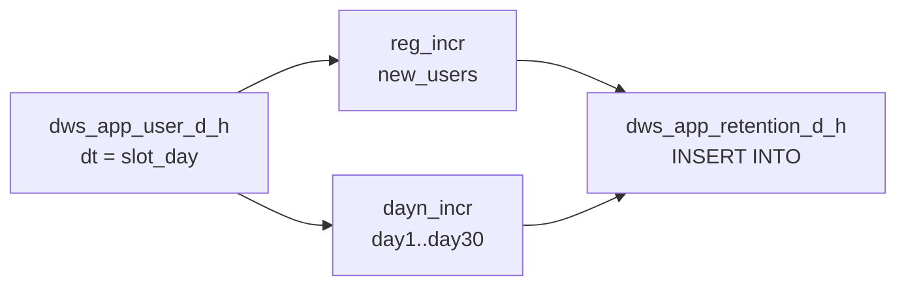

# dws_app_retention_d_h — 设计记忆文档

> 目录：`ops_system/04.dws/dws_app_retention_d_h/`  
> 目标表：`dws.dws_app_retention_d_h`（StarRocks AGGREGATE KEY + BITMAP_UNION）  
> **唯一上游事实表：`dws.dws_app_user_d_h`**（小时/天脚本仅调度窗口不同）

---

## 1. 文件清单

| 文件 | 作用 |
|------|------|
| `dws_app_retention_d_h_ddl.sql` | 建表 |
| `dws_app_retention_d_h_hourly.sql` | 小时任务：`INSERT INTO` 累加 bitmap |
| `dws_app_retention_d_h_daily.sql` | 天任务：`INSERT OVERWRITE` 昨日 cohort 分区兜底 |
| `dws_app_retention_d_h.sql` | 索引说明 |
| `dws_app_retention_d_h_old.sql` | 历史 VIEW 方案（参考，已废弃） |

---

## 2. 表结构要点

- **分区键 `dt`**：cohort 注册日（非活跃日）
- **维度**：`app_code, channel, region, device`（无 `user_type`，从 user_d_h 跨 user_type 做 `BITMAP_UNION`）
- **度量**：`new_users`, `day1_ret_cnt` … `day30_ret_cnt` 均为 **BITMAP**，聚合函数 `BITMAP_UNION`
- **留存定义**：`dayN_ret_cnt = cohort.new_users ∩ active(cohort_dt + N 日).active_users`（**strict-channel**：`cohort.channel = active.channel`）

查询人数：`BITMAP_COUNT(dayN_ret_cnt)`；守恒：`BITMAP_COUNT(dayN) ≤ BITMAP_COUNT(new_users)`。

---

## 3. 与 dws_app_user_d_h 的关系

```
DWD 明细
  → dws_app_user_d_h_hourly / daily（活跃/注册 bitmap 累加）
  → dws_app_retention_d_h_hourly / daily（留存 bitmap）
```

| 层级 | 表 | 写入方式 |
|------|-----|----------|
| 活跃 | `dws_app_user_d_h` | hourly `INSERT INTO`；daily `INSERT OVERWRITE` 昨日 |
| 留存 | `dws_app_retention_d_h` | hourly `INSERT INTO`；daily `INSERT OVERWRITE` 昨日 cohort 分区 |

**留存脚本不读 DWD**，只读 `dws_app_user_d_h` 已聚合好的 `new_users` / `active_users`。

---

## 4. 小时任务 vs 天任务

### 4.1 对比

| 项 | hourly | daily |
|----|--------|-------|
| 脚本 | `dws_app_retention_d_h_hourly.sql` | `dws_app_retention_d_h_daily.sql` |
| 写入 | `INSERT INTO` | `INSERT OVERWRITE PARTITION ('p$[yyyyMMdd-1]')` |
| 调度时刻示例 | 每天 **:40** | T+1（如 03:00） |
| 时间参数 | `slot_start` ~ `slot_end` **1 小时** | `slot_start` 昨日 00:00，`slot_end` 今日 00:00 |
| 取数窗口 | `user_d_h.dt = DATE(slot_start)` **当日分区**（截至本小时已累加） | `user_d_h.dt = T-1` cohort + `[T-1, T-1+30]` 活跃日 |
| 目的 | 当日留存随小时推进、近实时 | 昨日闭窗后权威全量 |

### 4.2 小时调度示例

运行时刻 **15:40**：

- `slot_start_time` = `2026-05-20 14:00:00`
- `slot_end_time`   = `2026-05-20 15:00:00`
- 区间：**[14:00, 15:00)**，仅 1 小时

**前置**：先跑 `dws_app_user_d_h_hourly`（同 `slot_start` / `slot_end`），把 14:00–15:00 事件累加进 `user_d_h` 的 `dt=2026-05-20` 分区。

### 4.3 天调度示例

- `PARTITION ('p$[yyyyMMdd-1]')`
- `slot_start_time` = `yyyy-MM-dd-1 00:00:00`
- `slot_end_time`   = `yyyy-MM-dd 00:00:00`

**前置**：`dws_app_user_d_h_daily` 已产出昨日及后推 30 天的完整日分区。

---

## 5. 小时脚本逻辑（`dws_app_retention_d_h_hourly.sql`）

### 5.1 数据流



`slot_day = DATE(slot_start_time)`（活跃日历日，通常与 slot 同一天）。

### 5.2 CTE 说明

| CTE | 来源 | 说明 |
|-----|------|------|
| `user_day` | `user_d_h` where `dt = slot_day` | 当日 `new_users` / `active_users`（跨 user_type 合并） |
| `reg_incr` | `user_day.new_users_bm` | 写入当日 cohort 的 `new_users` 增量行 |
| `active_batch` | `user_day.active_bm` | 当日按 `app_code+channel` 的活跃 bitmap |
| `cohort` | `user_d_h` where `dt ∈ [slot_day-30, slot_day)` | 历史注册 cohort（闭窗日前的 new_users） |
| `dayn_incr` | `BITMAP_AND(cohort_bm, active_bm)` | 仅当 `active_dt = slot_day` 且 `slot_day = cohort_dt + N` 时命中 dayN |

### 5.3 dayN 命中规则

单小时跑批时，活跃日固定为 `slot_day`，故**每个 cohort 最多命中一个 dayN**：

- `cohort_dt = slot_day - N` → 写入 `dayN_ret_cnt`
- 公式：`active_dt = DATE_ADD(cohort_dt, INTERVAL N DAY) = slot_day`

### 5.4 为何 INSERT INTO 不会重复计数

1. 每小时写入的是 **截至当前时刻** 在 `user_d_h` 上可见的 bitmap 片段（当日活跃随 user_h hourly 增大）。
2. 表引擎对同主键做 **BITMAP_UNION**，同一 `uid@app_id` 多次写入只保留 1 位。
3. **不要用 COUNT 累加**；不要用无并集的重复主键维度。

---

## 6. 天脚本逻辑（`dws_app_retention_d_h_daily.sql`）

### 6.1 数据流

- **cohort**：`user_d_h` where `dt = DATE(slot_start_time)`（昨日完整 `new_users`）
- **active_src**：`user_d_h` where `dt ∈ [昨日, 昨日+30天]` 的 `active_users`
- **输出**：对昨日 cohort 一次性算齐 `new_users` + `day1`…`day30`，**OVERWRITE** 分区 `p$[yyyyMMdd-1]`

### 6.2 与 hourly 分工

| 场景 | 谁负责 |
|------|--------|
| 当天 10:00 看昨日 cohort 的 day1 | hourly 累加（依赖 user_h 当日分区） |
| 日切后昨日 cohort 最终留存 | **daily OVERWRITE 为准** |

---

## 7. 海豚调度建议

```text
每小时 :40
  1. dws_app_user_d_h_hourly     （slot_start / slot_end = 上一整点小时）
  2. dws_app_retention_d_h_hourly（同参数）

每日 T+1
  1. dws_app_user_d_h_daily
  2. dws_app_retention_d_h_daily
```

全局参数（hourly 示例）：

- `slot_start_time` = `$[yyyy-MM-dd HH:mm:ss]`（上一小时整点）
- `slot_end_time`   = `$[yyyy-MM-dd HH:mm:ss]`（当前小时整点）

---

## 8. 注意事项

1. **SQL 注释**中不要写海豚占位符字面量（如 `yyyy-MM-dd`），避免 DS 误解析。
2. `user_d_h` 需保留 **≥ 31 天** 分区，否则 day30 无法计算。
3. **channel 口径**：留存与 user_d_h 一致，strict-channel（活跃渠道须与注册 cohort 渠道相同）。
4. **hash**：`bitmap_hash64_udf(CONCAT(uid, '@', app_id))`，与 user_d_h 保持一致。
5. 历史方案 `dws_app_retention_d_h_old.sql` 为 VIEW + `BITMAP_UNION_COUNT`（输出 BIGINT），与当前 bitmap 表不同，勿混用。

---

## 9. 变更记录（摘要）

| 日期 | 变更 |
|------|------|
| 初版 | 从 DWD 直算；后拆 hourly / daily |
| 当前 | 统一上游 `dws_app_user_d_h`；hourly `INSERT INTO` 按小时窗口；daily `OVERWRITE` 昨日兜底 |
