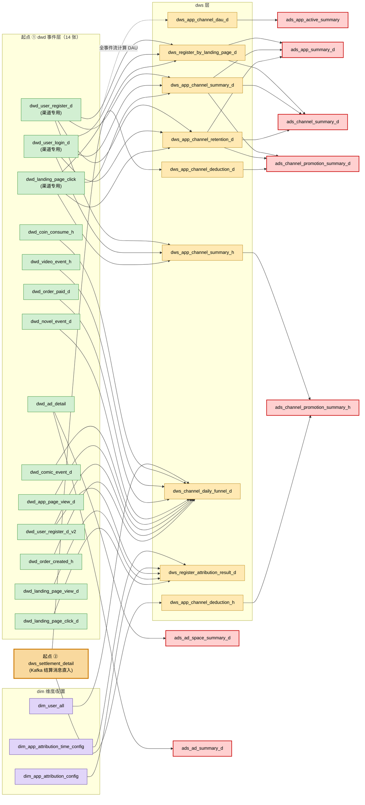

# 渠道广告全表 · 总览剧本

> **类型**：跨表总览 + 血缘 + 生产新鲜度核查（非单表 part 化数据核查）
> **目的**：一站式回看渠道系统 + 广告系统下所有活跃表的范围、代码、上下游、最新生产数据
> **首次落盘**：2026-04-28

## 1. 范围

- **数据来源**：本地 `metadata/metadata.db` → `tableprojectlink`
- **筛选**：`project.name IN ('渠道系统','广告系统')` AND `release_status != 'retired'`
- **代码扫描根**：`ops_system/` + `db/`（项目根全部子目录）
- **总表数**：**45 张**（渠道 43 + 广告 2 + `dw.dw_user_event_detail` 跨项目去重）
- **外部依赖**：0
- **算法**：从 `tableprojectlink` 全量起步（不要用反向追溯，会漏独立最下游 dws；参考 memory `feedback_lineage_scope_from_project_link.md`）
- **最下游 dws**（无任何下游消费，直接给 BI/查询用）：`dws_user_promotion_behavior_h`、`_d`、`_charge_h`、`_charge_d`

## 2. 重跑步骤（每次想刷新报告就按这个走）

### 2.1 重读本地元数据（必做）

```bash
sqlite3 /Users/arthur/Program/datacenter/dc-parent/metadata/metadata.db "
SELECT p.name AS project, t.database, t.name, t.release_status,
       COALESCE(t.display_name,'-') AS dn
FROM tabledefinition t
JOIN tableprojectlink l ON l.table_id=t.id
JOIN project p ON p.id=l.project_id
WHERE p.name IN ('渠道系统','广告系统')
ORDER BY p.id, t.database, t.name;
"
```

剔除 `release_status = 'retired'` 的行。新增的表如果不在下面第 3 节清单里，提示用户更新剧本。

### 2.2 重跑代码归属（确认每张表有 ETL/DDL 在仓库）

```bash
cd /Users/arthur/Program/datacenter/dc-parent
for fq in <表名列表>; do
  tbl="${fq#*.}"
  ins=$(grep -lriE "insert\s+(/\*.*?\*/\s+)?(into|overwrite)\s+\w+\.${tbl}\b" db ops_system 2>/dev/null | grep -v 弃用 | grep -v operating-system)
  echo "$fq -> $ins"
done
```

发现"找不到代码"立即提示用户。约定：源代码扫描必须含 `db/` 全部子目录。

### 2.3 重跑生产数据新鲜度

```bash
cd /Users/arthur/Program/datacenter/dc-parent
# 优先时间列尝试顺序：dt → date_key → event_time → hour → row_update_time → create_time
for fq in <表名列表>; do
  cols=$(mysql --defaults-extra-file=.claude/database/my.cnf -N -e "DESC ${fq}" 2>/dev/null | awk '{print $1}' | tr '\n' ' ')
  for c in dt date_key event_time hour row_update_time create_time; do
    echo "$cols" | grep -wq "$c" && pick="$c" && break
  done
  mysql --defaults-extra-file=.claude/database/my.cnf -N -e "SELECT MAX(\`${pick}\`), COUNT(*) FROM ${fq}"
done
```

判定规则：
- 实时表（按 event_time）滞后 > 5 分钟 → 告警
- 小时表（如 `*_h`、`_summary_h`）滞后 > 2 小时 → 告警
- 日表（如 `*_d`、`_summary_d`、`_retention_d` 等）滞后 > 36 小时（即超 T-1）→ 告警
- 配置维度（`dim_app_attribution_*`）长期不变属正常
- 全量小表（`ads_app_active_summary`，无日期列）无法用 max(date) 判断

### 2.4 检查外部表（目标 = 0）

跑完上游分析后：
```bash
# 直接上游 grep
grep -nE "(FROM|JOIN)\s+\w+\." <每个表的 ETL 文件> | awk -F'.' '{print $1, $2}' | sort -u
```

把"上游表名"减去"已挂渠道+广告项目的表名"，剩下的就是外部表。**0 = ✅，> 0 → 立即提醒用户补 OM 项目归属**，不要藏在最终报告里。

### 2.5 输出：报告 / Mermaid 图

报告位置：`.claude/database/reports/lineage__channel_ad_online__YYYY-MM-DD.md`

格式遵循该文件第 2/3/4 节风格（窄表 + 独立代码归属 + Mermaid）。

## 3. 表清单（35 张活跃表，2026-04-28 快照）

> 字段简表，更详细见 [reports/lineage__channel_ad_online__2026-04-28.md](../reports/lineage__channel_ad_online__2026-04-28.md)

| # | 项目 | 层 | 表 | 中文名 | 状态 |
|---|---|---|---|---|---|
| 1 | 渠道+广告 | dw | `dw.dw_user_event_detail` | 用户事件明细 | online |
| 2 | 渠道 | dim | `dim.dim_app_attribution_config` | 渠道归因配置 | online |
| 3 | 渠道 | dim | `dim.dim_app_attribution_time_config` | 渠道归因时间分段分值配置 | online |
| 4 | 渠道 | dim | `dim.dim_user_all` | 用户基本信息表 | online |
| 5 | 渠道 | dwd | `dwd.dwd_ad_detail` | 广告明细-渠道专用 | online |
| 6 | 渠道 | dwd | `dwd.dwd_app_page_view_d` | 浏览页面 | online |
| 7 | 渠道 | dwd | `dwd.dwd_coin_consume_h` | 金币消费小时分区表 | online |
| 8 | 渠道 | dwd | `dwd.dwd_comic_event_d` | 漫画事件 | online |
| 9 | 渠道 | dwd | `dwd.dwd_landing_page_click` | 落地页点击渠道专用 | online |
| 10 | 渠道 | dwd | `dwd.dwd_landing_page_click_d` | 落地页点击 | online |
| 11 | 渠道 | dwd | `dwd.dwd_landing_page_view_d` | 打开落地页 | online |
| 12 | 渠道 | dwd | `dwd.dwd_novel_event_d` | 小说事件 | online |
| 13 | 渠道 | dwd | `dwd.dwd_order_created_h` | 订单创建小时分区表 | online |
| 14 | 渠道 | dwd | `dwd.dwd_order_paid_d` | 订单支付成功 | online |
| 15 | 渠道 | dwd | `dwd.dwd_user_login_d` | 登录事件-渠道专用 | online |
| 16 | 渠道 | dwd | `dwd.dwd_user_register_d` | 注册明细-渠道专用 | online |
| 17 | 渠道 | dwd | `dwd.dwd_user_register_d_v2` | 用户注册 | online |
| 18 | 渠道 | dwd | `dwd.dwd_video_event_h` | 视频事件小时分区表 | online |
| 19 | 渠道 | dws | `dws.dws_app_channel_dau_d` | 渠道活跃日汇总 | online |
| 20 | 渠道 | dws | `dws.dws_app_channel_deduction_d` | 渠道扣量日汇总 | developing ⚠️ |
| 21 | 渠道 | dws | `dws.dws_app_channel_deduction_h` | 渠道扣量小时统计 | online |
| 22 | 渠道 | dws | `dws.dws_app_channel_retention_d` | 渠道留存 | online |
| 23 | 渠道 | dws | `dws.dws_app_channel_summary_d` | 渠道指标日中间表 | online |
| 24 | 渠道 | dws | `dws.dws_app_channel_summary_h` | 渠道指标小时中间表 | online |
| 25 | 渠道 | dws | `dws.dws_channel_daily_funnel_d` | APP渠道漏斗聚合表 | online |
| 26 | 渠道 | dws | `dws.dws_register_attribution_result_d` | 渠道归因 | online |
| 27 | 渠道 | dws | `dws.dws_register_by_landing_page_d` | 落地页下载 | online |
| 28 | 渠道 | dws | `dws.dws_settlement_detail` | 渠道结算表 | online |
| 29 | 渠道 | ads | `ads.ads_app_active_summary` | APP活跃汇总 | online |
| 30 | 渠道 | ads | `ads.ads_app_summary_d` | 应用统计 | online |
| 31 | 渠道 | ads | `ads.ads_channel_promotion_summary_d` | 渠道推广日汇总 | online |
| 32 | 渠道 | ads | `ads.ads_channel_promotion_summary_h` | 渠道推广汇总 | online |
| 33 | 渠道 | ads | `ads.ads_channel_summary_d` | 渠道汇总 | online |
| 34 | 广告 | ads | `ads.ads_ad_space_summary_d` | 广告位曝光和点击 | online |
| 35 | 广告 | ads | `ads.ads_ad_summary_d` | 广告汇总 | online |

⚠️ #20 仍标 `developing` 但生产实跑，建议改 online。

## 4. 数据来源 + 处理程序（每张表的写入代码归属）

| 表 | 写入代码 |
|---|---|
| `dw.dw_user_event_detail` | Flink [db/flink-sql/数据分流.sql](../../../db/flink-sql/数据分流.sql) |
| `dim.dim_app_attribution_config` | DDL+种子 [ops_system/04.dws/dws.dws_register_attribution_result_d/ios_mpv_config.sql](../../../ops_system/04.dws/dws.dws_register_attribution_result_d/ios_mpv_config.sql) |
| `dim.dim_app_attribution_time_config` | 同上 |
| `dim.dim_user_all` | DDL+ETL hourly+daily [ops_system/06.dim/job_dim_user_type_d/](../../../ops_system/06.dim/job_dim_user_type_d/) |
| `dwd.dwd_ad_detail` | [db/dwd/广告.sql](../../../db/dwd/广告.sql) |
| `dwd.dwd_app_page_view_d` | DDL+hourly+daily [ops_system/02.dwd/job_dwd_page_type_d/](../../../ops_system/02.dwd/job_dwd_page_type_d/) |
| `dwd.dwd_coin_consume_h` | DDL+ETL [ops_system/02.dwd/dwd_coin_consume_h/dwd_coin_consume_h.sql](../../../ops_system/02.dwd/dwd_coin_consume_h/dwd_coin_consume_h.sql) |
| `dwd.dwd_comic_event_d` | DDL+ETL [ops_system/02.dwd/job_dwd_comic_type_d/dwd_comic_event_d.sql](../../../ops_system/02.dwd/job_dwd_comic_type_d/dwd_comic_event_d.sql) |
| `dwd.dwd_landing_page_click` | [db/dwd/新增活跃用户.sql](../../../db/dwd/新增活跃用户.sql) |
| `dwd.dwd_landing_page_click_d` | DDL+ETL [ops_system/02.dwd/job_dwd_landing_type_d/dwd_landing_page_click_d.sql](../../../ops_system/02.dwd/job_dwd_landing_type_d/dwd_landing_page_click_d.sql) |
| `dwd.dwd_landing_page_view_d` | [ops_system/02.dwd/job_dwd_landing_type_d/dwd_landing_page_view_d.sql](../../../ops_system/02.dwd/job_dwd_landing_type_d/dwd_landing_page_view_d.sql) |
| `dwd.dwd_novel_event_d` | DDL+ETL [ops_system/02.dwd/jov_dwd_novel_type_d/dwd_novel_event_d.sql](../../../ops_system/02.dwd/jov_dwd_novel_type_d/dwd_novel_event_d.sql) |
| `dwd.dwd_order_created_h` | [ops_system/02.dwd/dwd_order_created_h/dwd_order_created_h.sql](../../../ops_system/02.dwd/dwd_order_created_h/dwd_order_created_h.sql) |
| `dwd.dwd_order_paid_d` | DDL+hourly+daily [ops_system/02.dwd/job_dwd_order_type_d/](../../../ops_system/02.dwd/job_dwd_order_type_d/) |
| `dwd.dwd_user_login_d` | [db/dwd/新增活跃用户.sql](../../../db/dwd/新增活跃用户.sql) |
| `dwd.dwd_user_register_d` | [db/dwd/新增活跃用户.sql](../../../db/dwd/新增活跃用户.sql) |
| `dwd.dwd_user_register_d_v2` | DDL+hourly+daily [ops_system/02.dwd/job_dwd_user_type_d/](../../../ops_system/02.dwd/job_dwd_user_type_d/) |
| `dwd.dwd_video_event_h` | DDL+ETL [ops_system/02.dwd/dwd_video_event_h/dwd_video_event_h.sql](../../../ops_system/02.dwd/dwd_video_event_h/dwd_video_event_h.sql) |
| `dws.dws_app_channel_dau_d` | [db/dws/用户活跃.sql](../../../db/dws/用户活跃.sql) |
| `dws.dws_app_channel_deduction_d` | [db/dws/结算详情.sql](../../../db/dws/结算详情.sql) |
| `dws.dws_app_channel_deduction_h` | [db/dws/结算详情.sql](../../../db/dws/结算详情.sql) |
| `dws.dws_app_channel_retention_d` | [db/dws/dws.sql](../../../db/dws/dws.sql) |
| `dws.dws_app_channel_summary_d` | [db/dws/dws.sql](../../../db/dws/dws.sql) |
| `dws.dws_app_channel_summary_h` | [db/dws/dws.sql](../../../db/dws/dws.sql) |
| `dws.dws_channel_daily_funnel_d` | [ops_system/04.dws/dws_channel_daily_funnel_d/dws_channel_daily_funnel_d.sql](../../../ops_system/04.dws/dws_channel_daily_funnel_d/dws_channel_daily_funnel_d.sql) |
| `dws.dws_register_attribution_result_d` | [ops_system/04.dws/dws.dws_register_attribution_result_d/dws_register_attribution_result_d.sql](../../../ops_system/04.dws/dws.dws_register_attribution_result_d/dws_register_attribution_result_d.sql) |
| `dws.dws_register_by_landing_page_d` | [db/dws/dws.sql](../../../db/dws/dws.sql) |
| `dws.dws_settlement_detail` | 批 [db/dws/dws_settlement_detail.sql](../../../db/dws/dws_settlement_detail.sql) · Flink [db/dws/结算数据-flink.sql](../../../db/dws/结算数据-flink.sql) · DDL [db/dws/结算详情.sql](../../../db/dws/结算详情.sql) |
| `ads.ads_app_active_summary` | [db/ads/ads.sql L361-390](../../../db/ads/ads.sql#L361-L390) |
| `ads.ads_app_summary_d` | [db/ads/ads.sql L1-67](../../../db/ads/ads.sql#L1-L67) |
| `ads.ads_channel_promotion_summary_d` | [db/ads/ads.sql L108-159](../../../db/ads/ads.sql#L108-L159) |
| `ads.ads_channel_promotion_summary_h` | [db/ads/ads.sql L160-223](../../../db/ads/ads.sql#L160-L223) |
| `ads.ads_channel_summary_d` | [db/ads/ads.sql L391-461](../../../db/ads/ads.sql#L391-L461) |
| `ads.ads_ad_space_summary_d` | [db/ads/ads.sql L253-281](../../../db/ads/ads.sql#L253-L281) |
| `ads.ads_ad_summary_d` | DDL [L313-342](../../../db/ads/ads.sql#L313-L342) · ETL1 [L282-312](../../../db/ads/ads.sql#L282-L312) · ETL2 [L343-359](../../../db/ads/ads.sql#L343-L359) |

## 5. 数据流 Mermaid（起点 = dwd 组 + dws_settlement_detail）



> 图说明：
> - 起点 ① = dwd 事件层（14 张），全部内部
> - 起点 ② = `dws_settlement_detail`（Kafka 结算消息直入）
> - dim 是配置维度，旁路输入 dws
> - 不画 dw / Kafka 节点
> - `dws_app_channel_dau_d` SQL 实读 dw（求全事件 DAU），图上虚线代表"等价于消费整个 dwd 事件组"

## 6. 同事件双口径对照

| 事件类型 | 渠道专用 dwd | 公共 dwd（也已挂渠道） |
|---|---|---|
| 用户注册 | `dwd_user_register_d` | `dwd_user_register_d_v2` |
| 用户登录 | `dwd_user_login_d` | （仅渠道专用） |
| 落地页点击 | `dwd_landing_page_click` | `dwd_landing_page_click_d` |
| 落地页打开 | （无渠道专用） | `dwd_landing_page_view_d` |
| 订单创建 | `dwd_order_created_h` | （仅渠道专用） |
| 订单支付 | （无渠道专用） | `dwd_order_paid_d` |
| 广告事件 | `dwd_ad_detail` | （无公共） |
| 页面浏览 | （无渠道专用） | `dwd_app_page_view_d` |
| 漫画事件 | （无渠道专用） | `dwd_comic_event_d` |
| 小说事件 | （无渠道专用） | `dwd_novel_event_d` |
| 视频事件 | （无渠道专用） | `dwd_video_event_h` |
| 金币消耗 | （无渠道专用） | `dwd_coin_consume_h` |

## 7. 已知观察 / 维护项

1. **OM 状态**：`dws.dws_app_channel_deduction_d` 仍 `developing` 但生产在跑，建议改 online
2. **`ads.ads_app_active_summary`** PRIMARY KEY = `app_id`，全量覆盖小表，缺日期列；建议加 `update_time datetime`
3. **`dw.dw_user_event_detail`** 偶有 1 条 event_time = 2038-01-01 的脏数据；不影响下游（按 `event_time < <slot_end>` 过滤），建议加质量告警
4. **renamed**：`ads.ads_user_global_status_all` 旧文件路径 `ops_system/05.ads/job_ads_user_global_status_d/ads_user_global_status_d.sql` 已 git mv 到 `ops_system/05.ads/job_ads_user_global_status_all/ads_user_global_status_all.sql`（不在本剧本范围，仅记录）

## 8. 报告产出位置

- 报告：`.claude/database/reports/lineage__channel_ad_online__YYYY-MM-DD.md`
- 最近一次：[2026-04-28](../reports/lineage__channel_ad_online__2026-04-28.md)
