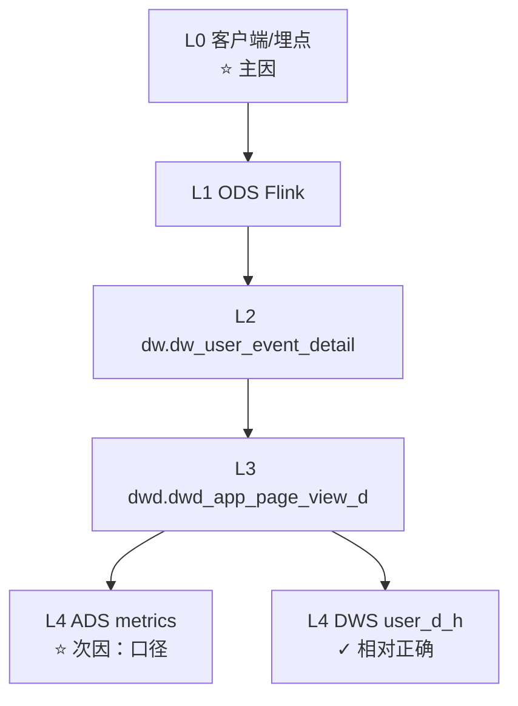

# TJ-001 DAU / DAD 异常说明文档

> **文档版本**：2026-05-29  
> **核查对象**：生产 StarRocks（sr_prod）  
> **案例 app**：`TJ-001`  
> **核查日期**：`2026-05-27`（主）、`2026-05-28`（辅）  
> **关联表**：`ads.ads_app_metrics_daily_d`、`dwd.dwd_app_page_view_d`、`dw.dw_user_event_detail`、`dws.dws_app_user_d_h`

---

## 1. 问题描述

在 **实时指标天表** `ads.ads_app_metrics_daily_d` 上，TJ-001 出现：

| 日期 | DAU（uid 日活） | DAD（设备日活） | 比例 |
|------|----------------|----------------|------|
| 2026-05-27 | 6,144 | 9,357,917 | ~1:1520 |
| 2026-05-28 | 5,916 | 9,408,704 | ~1:1590 |

业务直觉：**6k 用户日活 vs 900 万设备日活不合理**。  
同期 TJ-011 为 DAU≈6.3 万、DAD≈56.8 万（约 1:9），虽仍偏高但量级可理解。

---

## 2. 指标口径说明

### 2.1 表与字段

| 业务叫法 | 表 | 字段 | 查法 |
|----------|-----|------|------|
| 实时指标天表 | `ads.ads_app_metrics_daily_d` | `dau_ids` | `BITMAP_COUNT(dau_ids)` |
| 设备日活（ADS） | 同上 | `dad_ids` | `BITMAP_COUNT(dad_ids)` |
| 用户活跃（DWS） | `dws.dws_app_user_d_h` | `active_users` | `BITMAP_UNION_COUNT(...)` |
| 设备活跃（DWS） | 同上 | `active_devices` | `BITMAP_UNION_COUNT(...)` |

**注意**：
- ADS 维度字段为 **`app_id`**（如 `TJ-001`），不是 `app_code`。
- ADS DAD 与 DWS `active_devices` **不可直接对比**（过滤条件不同，见 §4）。

### 2.2 ADS ETL 中 DAU / DAD 的来源

程序：`ops_system/05.ads/job_ads_app_metrics_daily_d/ads_app_metrics_daily_d.sql`

| 分支 | 数据源 | 过滤条件 | 聚合键 |
|------|--------|----------|--------|
| **DAU**（uid_attribution） | `dwd.dwd_app_page_view_d` | `uid IS NOT NULL` | `(app_id, uid)` |
| **DAD**（did_attribution） | 同上 | `device_id IS NOT NULL` | `(app_id, device_id)` |

**关键不对称**：
- DAU 理论上只含「有 uid 字段」的记录，但 **`uid=''` 空串在 SQL 中 `IS NOT NULL` 仍为真**。
- DAD **不含 uid 条件**，所有带 `device_id` 的匿名访问全部计入。

---

## 3. 分层核查结论

核查顺序：**ADS → DWS → DWD → DW → ODS/客户端**（详见 playbook `datacheck_layered_verification.md`）。



### 3.1 各层结论摘要

| 层级 | 是否正确 | TJ-001 匿名段 device 数 | 说明 |
|------|----------|------------------------|------|
| **L0 客户端** | ❌ 主因 | — | 匿名 uid=`''`；device_id 高 churn（52% device 仅 1 PV） |
| **L1 ODS** | ⚠️ 透传 | — | `COALESCE(uid,'')` 将 NULL 变为空串 |
| **L2 DW** | ✓ 如实存储 | **9,353,853** | 与 DWD device 基数一致 |
| **L3 DWD** | ✓ 过滤 page_key，未校验身份 | **9,353,853** | 非 ETL 写坏 |
| **L4 ADS** | ❌ 口径设计 | DAD=**9,357,917** | 含全部匿名 device_id |
| **L4 DWS** | ✓ | active_devices=**5,738** | `TRIM(uid)<>''` |

**DW 与 DWD 匿名 device 数一致** → 问题在 **源数据 + ADS 口径**，不是 DWD 计算错误。

### 3.2 uid 形态

| uid 类型 | PV | device 数 |
|----------|-----|----------|
| **空串 `''`** | 6042 万（99.98%） | 935 万 |
| 有值 uid | 1.07 万 | 5738 |
| SQL `NULL` | **0** | **0** |

有效 uid 判断应使用：**`uid IS NOT NULL AND TRIM(uid) <> ''`**。

### 3.3 登录用户对照（正常）

| 段 | uid 数 | device 数 | 比例 |
|----|--------|----------|------|
| logged_in | 6,144 | 5,738 | ~1.07:1 ✓ |

**合理的 TJ-001「人类设备日活」≈ 5,700**，与 DWS `active_devices` 一致。

### 3.4 device_id vs device_fingerprint

| 指标 | 匿名段（全量） | 单页 archives 段 |
|------|---------------|-----------------|
| distinct device_id | 935 万 | 285 万 |
| distinct device_fingerprint | 74 万 | 28.3 万 |
| device_id / fingerprint | ~12.6 : 1 | ~10 : 1 |

`device_fingerprint` 比 raw `device_id` 稳定一个数量级，更适合作为「设备」键讨论（仍含爬虫，但 churn 更低）。

---

## 4. 匿名流量页面分布

**TJ-001 / 2026-05-27 / 无 uid**

| page_key | page_name | PV | device 数 |
|----------|-----------|-----|----------|
| archives | 文章 | 3321 万 | 674 万 |
| search | 搜索 | 1196 万 | 256 万 |
| wpcz | 今日吃瓜 | 420 万 | 135 万 |
| home | 首页 | 394 万 | 288 万 |
| page | 页面 | 287 万 | 94 万 |
| tag | 标签 | 231 万 | 86 万 |

**特征**：SEO / H5 内容浏览页，非登录/个人中心类页面。

### 4.1 每个 device 访问页面数

| 访问页面数 | device 数 | 占比 |
|-----------|----------|------|
| 仅 1 页 | 534 万 | **57%** |
| 2 页 | 208 万 | 22% |
| 3–5 页 | 185 万 | 20% |
| >10 页 | 4374 | 0.05% |

平均：每 device **1.75 个页面**、**6.46 次 PV**。

**仅访问 1 页且为 archives 的 device：285 万**（占全部匿名 device 的 30%）。

---

## 5. 单页 archives device 下钻（爬虫分析）

**定义**：`uid` 为空 + 当天只访问 `archives` 一个 page_key 的 device。

### 5.1 终端分布

| 终端 | device 数 | 每 device PV |
|------|----------|-------------|
| Android | 110 万 | 1.22 |
| iOS | 99 万 | 1.31 |
| PC | 76 万 | 1.09 |

三端均匀、几乎均为 **1 PV 即走**。

### 5.2 小时分布

- **24 小时均有流量**，非典型人类作息。
- 高峰：0 点（30.8 万 device）、23 点（25.8 万 device）。
- 低谷 4–5 点仍有 6–7 万 device/小时。
- 每 device PV 全天稳定在 **1.14~1.24**。

### 5.3 IP 集中度（强爬虫信号）

| 指标 | 数值 |
|------|------|
| 涉及 IP 数 | 72.1 万 |
| 单 IP 最多 device | **9,377**（`49.7.4.108`） |
| 单 IP ≥1000 device 的 IP | **367 个** |
| TOP 段 `49.7.4.x` | 28 万 device |
| Azure 云段（20.x / 4.15x / 4.246.x 等） | 31.6 万 device |

单 IP 上 **pv ≈ did**（≈1.0）→ **一 IP 一 device 打一次**，批量伪造 device_id。

### 5.4 User-Agent（DW 层；DWD 当前 `user_agent=NULL` 未落库）

| UA 特征 | device 数 | 判断 |
|---------|----------|------|
| **bingbot/2.0** | 37.4 万 | 微软搜索爬虫 |
| iPhone Safari 类 | 40.4 万 | 含 H5 / 伪造 UA |
| Mac Safari | 24.4 万 | 同上 |
| 裸 `android` 字符串 | 9.1 万 | 非标准 UA，脚本嫌疑 |

### 5.5 超高 PV 全站扫 device

| device_id（前 5 位） | 页面数 | PV |
|---------------------|--------|-----|
| 58c0ab84... | 31 | **159,126** |

少数 device 全天扫全站，为 aggressive 爬虫/脚本。

### 5.6 爬虫结论

单页 archives 285 万 device **不是 285 万真实用户**，而是多批来源叠加：

1. **Bing 等搜索引擎官方爬虫**（UA + Azure IP）
2. **IP 池批量脚本**（`49.7.4.x`，单 IP 数千 device）
3. **SDK 每次访问生成新 device_id**（device_id : fingerprint ≈ 10:1）
4. **少量全站高频爬虫**（单 device 15 万+ PV）

---

## 6. 根因总结

| 排序 | 层级 | 根因 |
|------|------|------|
| **①** | L0 客户端/埋点 | 匿名 SEO/H5 流量占 99.98% PV；`uid=''`；`device_id` 不持久化，每次访问新建 |
| **②** | L4 ADS 口径 | `dad_ids` 统计全部 `device_id`，含匿名一次性 device；与 DAU（登录 uid）人群不一致 |
| **③** | L1/L3 | ODS `COALESCE(uid,'')`；DWD 未落 UA、未标识 bot/anonymous，未做质量过滤 |

**不是** DWD/DW ETL 算错数；**是** 源数据质量 + 指标口径与业务预期不符。

---

## 7. 修复与治理建议

### 7.1 客户端 / 埋点（P0）

| 项 | 建议 |
|----|------|
| device_id | localStorage/cookie **持久化**，禁止每 PV 新建 UUID |
| 匿名标识 | 引入稳定 `visitor_id`，与登录 `uid` 分离 |
| 爬虫 | 识别 bingbot/Googlebot 后少打或打独立 `bot_*` 事件 |
| uid | 未登录传 **NULL 或省略**，避免传 `''` 空串 |

### 7.2 数仓口径（P0）

| 项 | 建议 |
|----|------|
| ADS DAU | `uid IS NOT NULL AND TRIM(uid) <> ''` |
| ADS DAD | 与业务对齐：① 仅登录 device；② 或 `device_fingerprint`；③ 或拆 `dad_human` / `dad_bot` |
| 报表 | 默认「设备日活」= 登录 device（~5700），不含 SEO 匿名 |
| 参考实现 | 对齐 `dws_app_user_d_h`（已用 `TRIM(uid)<>''`） |

**ADS SQL 最小改动示例**（`ads_app_metrics_daily_d.sql`）：

```sql
-- uid_attribution
WHERE dt = ${dt} AND uid IS NOT NULL AND TRIM(uid) <> ''

-- did_attribution（若业务 DAD = 登录设备）
WHERE dt = ${dt}
  AND device_id IS NOT NULL AND TRIM(device_id) <> ''
  AND uid IS NOT NULL AND TRIM(uid) <> ''
```

### 7.3 DWD / 数据质量（P1）

| 项 | 建议 |
|----|------|
| user_agent | DWD 恢复落库（当前写 NULL，无法下游滤 bot） |
| 衍生字段 | `is_anonymous`、`is_bot`（UA/IP 规则） |
| 可选过滤 | 已知 bot UA、单 IP 超阈值 device |

### 7.4 风控 / 运维（P1）

| 项 | 建议 |
|----|------|
| WAF | 对 `49.7.4.x`、单 IP >1000 device/天 限流 |
| 业务 | archives/search 未登录访问 rate limit |
| SEO | 与运营确认 robots.txt、bingbot 抓取策略 |

### 7.5 指标产品（P2）

- 大盘拆分：**人类 DAU / 人类 DAD / 爬虫 PV / SEO PV**
- TJ-001 专项监控：anon PV 占比、device_id/fingerprint 比、bingbot 占比

---

## 8. 核查方法论（后续必遵）

任何指标异常，**逐层核验到 `dw.dw_user_event_detail`**：

1. ADS 汇总值  
2. DWS 平行模型对照（理解口径差异）  
3. DWD 分段：`anon` vs `logged_in`  
4. DW 原始层：对比 device / fingerprint 基数  
5. 质量：单 IP 多 device、UA、pv=1 占比  

**uid 有效条件**：`uid IS NOT NULL AND TRIM(uid) <> ''`

Playbook：`.claude/database/playbooks/datacheck_layered_verification.md`  
经验沉淀：`.claude/memory/lessons/2026-05-29-dad-dau-layered-root-cause.md`

---

## 9. 附录：关键 SQL

完整诊断脚本：`.claude/database/reports/diag_tj001_dau_dad_anomaly.sql`

### 9.1 总览：匿名 vs 登录

```sql
SELECT
    CASE WHEN uid IS NULL OR TRIM(uid) = '' THEN 'anon' ELSE 'logged_in' END AS seg,
    COUNT(*) AS pv,
    COUNT(DISTINCT uid) AS uids,
    COUNT(DISTINCT device_id) AS devices
FROM dwd.dwd_app_page_view_d
WHERE dt = '2026-05-27' AND app_id = 'TJ-001'
GROUP BY 1;
```

### 9.2 ADS vs DWD 对齐

```sql
SELECT BITMAP_COUNT(dad_ids) AS ads_dad
FROM ads.ads_app_metrics_daily_d
WHERE dt = '2026-05-27' AND app_id = 'TJ-001';

SELECT COUNT(DISTINCT device_id) AS dwd_did
FROM dwd.dwd_app_page_view_d
WHERE dt = '2026-05-27' AND app_id = 'TJ-001'
  AND device_id IS NOT NULL;
```

### 9.3 单页 archives + IP 下钻

```sql
WITH single_arch AS (
    SELECT device_id
    FROM dwd.dwd_app_page_view_d
    WHERE dt = '2026-05-27' AND app_id = 'TJ-001'
      AND (uid IS NULL OR TRIM(uid) = '')
    GROUP BY device_id
    HAVING COUNT(DISTINCT page_key) = 1 AND MAX(page_key) = 'archives'
)
SELECT v.ip,
       COUNT(DISTINCT v.device_id) AS did_cnt,
       COUNT(*) AS pv
FROM dwd.dwd_app_page_view_d v
JOIN single_arch s ON v.device_id = s.device_id
WHERE v.dt = '2026-05-27' AND v.app_id = 'TJ-001'
GROUP BY v.ip
ORDER BY did_cnt DESC
LIMIT 30;
```

### 9.4 UA 分布（需 DW 层）

```sql
WITH single_arch AS ( /* 同上 */ )
SELECT LEFT(v.user_agent, 80) AS ua,
       COUNT(DISTINCT v.device_id) AS did_cnt
FROM dw.dw_user_event_detail v
JOIN single_arch s ON v.device_id = s.device_id
WHERE v.event = 'app_page_view' AND v.app_id = 'TJ-001'
  AND v.event_time BETWEEN '2026-05-27 00:00:00' AND '2026-05-27 23:59:59'
GROUP BY 1 ORDER BY did_cnt DESC LIMIT 10;
```

---

## 10. 相关文档索引

| 文件 | 用途 |
|------|------|
| `playbooks/ads.ads_app_metrics_daily_d.md` | 实时指标天表字段与查询 |
| `playbooks/datacheck_layered_verification.md` | 逐层 datacheck 通用剧本 |
| `reports/diag_tj001_dau_dad_anomaly.sql` | 可执行诊断 SQL |
| `memory/lessons/2026-05-29-dad-dau-layered-root-cause.md` | 经验沉淀 |
| `knowledge.md` § 逐层 datacheck | 知识库条目 |

---

## 11. 一句话结论

**TJ-001 的 900 万 DAD 不是 900 万真实设备**，而是 **未登录 SEO/爬虫流量（主访 archives/search）+ SDK 每次访问新建 device_id + ADS 口径将匿名 device 全量计入** 共同导致；真实登录设备日活约 **5700**，与 DWS 一致。治理需 **客户端持久化 device_id、ADS 口径修正、DWD 落 UA/ bot 标识、WAF 限流** 四层并行。
