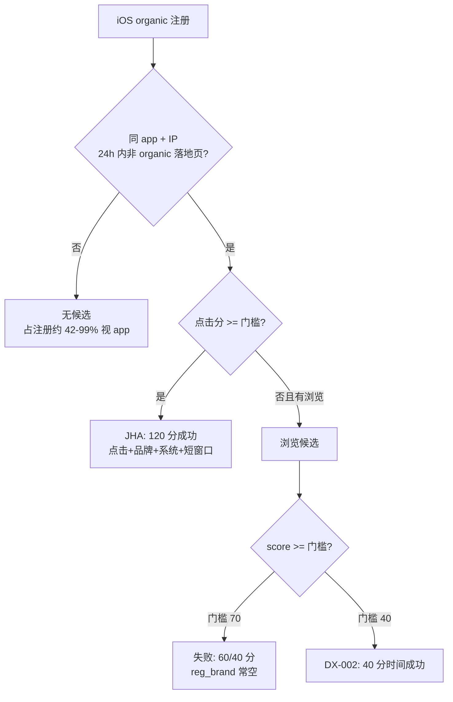

# 注册归因分 App 分析报告（生产）

| 项 | 内容 |
|----|------|
| 环境 | 生产 StarRocks |
| 区间 | 2026-04-04 ~ 2026-06-02 |
| 输出表 | `dws.dws_register_attribution_result_d` |
| 注册口径 | `dwd.dwd_user_register_d_v2`：iOS + `channel=organic` + `dim_app_attribution_config.is_run=1` |
| ETL | `ops_system/04.dws/dws.dws_register_attribution_result_d/dws_register_attribution_result_d.sql`（`mvp_v2`） |
| 原则 | **所有结论按 app 独立统计，禁止多 app 混算** |

---

## 1. 归因规则摘要

### 1.1 入围条件

- App 在 `dim.dim_app_attribution_config` 中 `is_run = 1`
- 注册：`channel = organic`、`device = ios`、`uid` 非空

### 1.2 候选匹配

- 用 **注册 IP = 落地页 IP** 关联 `dwd_landing_page_click_d` / `dwd_landing_page_view_d`
- 落地页事件在注册 **之前**，间隔 **≤ 86400 秒**（24h），分区 `dt-1` ~ `dt`
- 落地页 `channel` 非空且 **≠ organic**

### 1.3 打分与赢家

| 维度 | default 分值（`is_active=0`） | 说明 |
|------|------------------------------|------|
| 品牌 | 60 | 注册与落地页均非空且相等（清洗后） |
| 型号 | 20 | 同上 |
| 系统名 | 20 | 同上 |
| 系统版本 | 60 | 同上 |
| 时间 | 40 / 30 / 20 / 10 | ≤600s / ≤3600s / ≤21600s / ≤86400s |
| **门槛** | **70** | `score >= min_threshold` → `success` |

**例外（`is_active=1`）**：`DX-002`、`DX-055` — 门槛 **40**，品牌 10 / 型号 20 / 系统 20 / 版本 20。

**赢家顺序**：

1. 点击分 ≥ 门槛 → 用点击  
2. 否则若有浏览 → **用浏览**（即使点击存在但未过线）  
3. 否则记点击  

### 1.4 输出表重要限制

SQL 末尾 `WHERE source_event_id IS NOT NULL`：**无落地页 IP 候选的注册不会进表**，表中不会出现 `no_candidate` 行，需用「注册数 − 输出表行数」估算。

### 1.5 未归因原因编码

| 层级 | 原因 | 说明 |
|------|------|------|
| 表外 | **无候选** | 24h 内同 app 无同 IP 非 organic 点击/浏览 |
| 表内 | `score_below_threshold` | 有候选但 `score < score_threshold`（占表内失败 ~93%） |
| 表内 | `unattributed_reason IS NULL` | 与低分失败同类，历史字段未完全对齐（~7%） |

---

## 2. 全平台漏斗（仅作背景，不作为各 app 结论）

| 指标 | 数量 | 占注册% |
|------|------|--------|
| 可归因注册 | 1,194,198 | 100% |
| 进入输出表（有候选） | 243,576 | 20.4% |
| 归因成功 | 43,328 | 3.6% |
| 表内未成功 | 200,248 | 16.8% |
| **无候选（未进表）** | **~950,622** | **~79.6%** |

---

## 3. 分 App 总览

| app_id | 注册量 | 成功 | 占注册% | 无候选% | 有候选失败% | 候选内成功率 | 配置 |
|--------|-------:|-----:|--------:|--------:|------------:|-------------:|------|
| JHA-027 | 369,284 | 7,431 | 2.0% | 79.8% | 18.2% | 9.9% | default / 70 |
| DX-030 | 200,070 | 0 | 0% | 86.3% | 13.7% | 0% | default / 70 |
| JHA-069 | 122,365 | 15,062 | 12.3% | 64.6% | 23.0% | 34.8% | default / 70 |
| DX-002 | 92,392 | 7,817 | 8.5% | 88.2% | 3.3% | 71.9% | **active / 40** |
| JHA-063 | 90,735 | 7,811 | 8.6% | 70.4% | 21.0% | 29.1% | default / 70 |
| JHA-017 | 84,050 | 4,633 | 5.5% | 64.6% | 29.8% | 15.6% | default / 70 |
| DX-042 | 64,483 | 0 | 0% | 97.9% | 2.1% | 0% | default / 70 |
| DX-055 | 41,096 | 269 | 0.7% | 96.0% | 3.3% | 16.5% | **active / 40** |
| DX-085 | 38,332 | 0 | 0% | 92.9% | 7.1% | 0% | default / 70 |
| JHA-056 | 37,252 | 0 | 0% | 42.3% | 57.7% | 0% | default / 70 |
| DX-076 | 30,113 | 0 | 0% | 99.9% | 0.1% | 0% | default / 70 |
| JHA-160 | 24,026 | 305 | 1.3% | 85.4% | 13.4% | 8.7% | default / 70 |

---

## 4. 分 App 详细分析

### 4.1 JHA-069

**规模**：注册 122,365；成功 15,062（**全 app 成功数第一**）。

#### 归因成功 — 匹配因子

| 维度 | 结果 |
|------|------|
| 来源 | 点击 **97.1%**，浏览 2.9% |
| 得分 | **120 分占 93%**（品牌 60 + 系统 20 + 时间 40） |
| 品牌 | 成功行 **100%** `reg_brand = hit_brand` |
| 系统 | ~100% 系统名一致 |
| 时间 | **93%** 注册距落地页 **≤10 分钟** |

**结论**：成功路径 = **短窗口点击 + 注册品牌与落地页品牌对齐 + iOS 系统名一致**。

#### 未成功 — 原因与占比

| 原因 | 占注册 | 占表内失败 (28,205) |
|------|--------|---------------------|
| 无候选 | 64.6% | — |
| 分数 &lt; 70 | 23.0% | 100% |

**失败分桶**：60 分 **63%** | 40 分 **27%** | 10 分 3%

- **60 分**：系统 20 + 时间 40，**注册品牌多为空**（失败行 98% `reg_brand` 空）
- **40 分**：多为 **浏览赢家**，仅时间或弱设备分
- 失败来源：浏览 **81.6%**，点击 18.4%

#### 改进建议

1. 推广/落地页：降低 **64.6%** 无候选（IP 一致、channel 非空）。  
2. 注册 SDK：必填 `device_brand`、`system_version`，将 60 分抬到 ≥70。  
3. 规则：点击未过线时不要优先浏览。  
4. 清洗落地页 `channel` 异常值（如 `{}`）。

---

### 4.2 DX-002

**规模**：注册 92,392；成功 7,817；候选内成功率 **71.9%**（门槛低）。

#### 归因成功 — 匹配因子

| 维度 | 结果 |
|------|------|
| 来源 | 点击 **94.1%** |
| 得分 | **100% 为 40 分**（= 门槛 40） |
| 设备 | **无**品牌/型号/版本对齐记录 |
| 时间 | **100% ≤10 分钟** |

**结论**：成功几乎完全依赖 **「同 IP + 10 分钟内落地页」时间分 40 分**，属于 **低置信 IP 归因**。

#### 未成功 — 原因与占比

| 原因 | 占注册 | 说明 |
|------|--------|------|
| 无候选 | **88.2%** | 主矛盾 |
| 表内失败 | 3.3% (3,058) | 99.4% 为 **浏览**；得分 10/20/30（**45% 为 10 分**） |

**结论**：失败 = 仅有远时效浏览，时间档分值过低。

#### 改进建议

1. 优先扩落地页/IP 覆盖（近 9 成注册无候选）。  
2. 在门槛 40 基础上 **增加最低设备匹配**（防误归因）。  
3. 缩短点击→注册间隔；失败侧避免仅用远时效浏览。

---

### 4.3 JHA-063

**规模**：注册 90,735；成功 7,811（与 JHA-069 成功形态一致）。

#### 归因成功 — 匹配因子

- 点击 **97.4%**；得分 ~**120**；品牌 **100%** 匹配；**92% ≤10min**。

#### 未成功 — 原因与占比

| 原因 | 占注册 | 失败分桶（19,061） |
|------|--------|-------------------|
| 无候选 | 70.4% | — |
| 分数 &lt; 70 | 21.0% | 60 分 **47%**；40 分 **44%** |

- 浏览占失败 **83%**；注册品牌空 **99.9%**。

#### 改进建议

同 JHA-069：埋点 + 落地页 + 赢家逻辑；重点拉 **70%** 无候选人群。

---

### 4.4 JHA-027

**规模**：注册 **369,284**（最大）；成功 7,431，占注册仅 **2.0%**。

#### 归因成功 — 匹配因子

| 维度 | 结果 |
|------|------|
| 来源 | 点击 92.2% |
| 得分 | **120 分占 88%** |
| 品牌 | 成功行 **100%** 品牌对齐 |

**说明**：成功形态与 JHA-069 相同，但多集中在历史区间；**近 7 日候选内成功率≈0**（浏览 60 分普遍卡死）。

#### 未成功 — 原因与占比

| 原因 | 占注册 | 表内失败 (67,254) |
|------|--------|-------------------|
| 无候选 | 79.8% | — |
| 分数 &lt; 70 | 18.2% | 40 分 **71%**；60 分 **18%** |

- 失败 **70%** 浏览；`reg_brand` 空 **99.7%**。

#### 改进建议

1. **P0**：注册埋点补 `device_brand`、`system_version`。  
2. 落地页点击带合法 channel，保证 IP 一致。  
3. 评估本 app **单独降阈 / 浏览降权**（需业务审批）。  
4. 排查近期「全失败」是否包体/渠道变更。

---

### 4.5 JHA-017

**规模**：注册 84,050；成功 4,633。

#### 归因成功 — 匹配因子

- 点击 **98.4%**；**120 分占 92%**；品牌全匹配。  
- **数据质量**：成功渠道中 `attributed_channel = '{}'` 约 **492 条**（点击 channel 脏数据仍可能过线）。

#### 未成功 — 原因与占比

| 原因 | 占注册 | 失败分桶 (25,086) |
|------|--------|-------------------|
| 无候选 | 64.6% | — |
| 分数 &lt; 70 | 29.8% | **40 分 92%** |

- 失败 **83.5%** 浏览。

#### 改进建议

1. 清洗落地页 `channel`（`{}`）。  
2. 补注册设备字段。  
3. 近期日批候选内成功率已很高，重点仍是 **无候选 65%**。

---

### 4.6 JHA-056

**规模**：注册 37,252；成功 **0**；**57.7%** 注册有候选但全失败（全 app 最高）。

#### 未成功 — 原因与占比（唯一状态）

| 原因 | 占注册 | 失败分桶 (21,503) |
|------|--------|-------------------|
| 无候选 | 42.3% | — |
| 分数 &lt; 70 | **57.7%** | **60 分 72%**；40 分 21% |

- **60 分** = 系统 + 时间，**差 10 分**不过 70  
- **91%** 失败来自浏览；`reg_brand` **100%** 空

#### 改进建议

1. **P0**：注册必传 brand / system_version。  
2. 本 app 单独阈值（如 60）或调整浏览/点击赢家顺序。  
3. 查点击是否缺 channel 或被过滤为 organic。

---

### 4.7 DX-030

**规模**：注册 200,070；成功 **0**；候选 27,409 **全部失败**。

#### 未成功 — 原因与占比

| 原因 | 占注册 | 失败分桶 (27,409) |
|------|--------|-------------------|
| 无候选 | **86.3%** | — |
| 分数 &lt; 70 | 13.7% | 40 分 **39%**；**10 分 31%** |

- **93%** 浏览；设备维度几乎无分；avg 分 **25.7**。

#### 改进建议

1. 落地页/点击链路与 channel 治理（先解决 86% 无候选）。  
2. 缩短点击→注册间隔或 app 级时间分配置。  
3. 链路未就绪前评估暂停 `is_run`。

---

### 4.8 DX-042

**规模**：注册 64,483；成功 **0**。

| 原因 | 占注册 |
|------|--------|
| 无候选 | **97.9%** |
| 表内失败 | 2.1%（40/10 分浏览） |

**改进**：先接入落地页与 IP；暂不具备归因条件。

---

### 4.9 DX-055

**配置**：`is_active=1`，门槛 **40**。

**规模**：注册 41,096；成功 269（0.7%）。

#### 归因成功

- 得分：40 分 **78%**，60 分 20% → 仍以时间/弱版本为主；**reg_brand 全空**。

#### 未成功

- 无候选 **96%**；失败 **57% 为 10 分**（时间档极低）。

#### 改进建议

同 DX-002：扩候选 + 提高设备匹配要求，避免长期「40 分侥幸成功」。

---

### 4.10 DX-085

**规模**：注册 38,332；成功 **0**。

| 原因 | 占注册 |
|------|--------|
| 无候选 | 92.9% |
| 表内失败 | 7.1%（avg 35 分；**75% ≤10min 仍 &lt;70**） |

**改进**：有部分短窗口浏览；补设备字段或 app 级阈值。

---

### 4.11 DX-076

**规模**：注册 30,113；成功 **0**；输出表仅 **27** 条候选。

| 原因 | 占注册 |
|------|--------|
| 无候选 | **99.9%** |

**改进**：落地页几乎未接入，优先建设采集。

---

### 4.12 JHA-160

**规模**：注册 24,026；成功 305。

#### 归因成功 — 匹配因子

| 维度 | 结果 |
|------|------|
| 来源 | 点击 **99%** |
| 得分 | avg **174**（高配） |
| 版本 | **97%** 行 `reg_system_version = hit_system_version` |

**结论**：成功路径最完整：**点击 + 品牌 + 系统 + 版本 + 短窗口**。

#### 未成功 — 原因与占比

| 原因 | 占注册 | 说明 |
|------|--------|------|
| 无候选 | 85.4% | |
| 分数 &lt; 70 | 13.4% | **82% 失败仍来自点击** 但分低（40 分占 90%） |

#### 改进建议

1. 将成功样本字段规范推广到失败点击。  
2. 扩落地页覆盖（85% 无候选）。  
3. 排查失败点击事件是否缺 brand/version。

---

## 5. 成功 / 失败形态对照

### 5.1 成功类型矩阵

| 类型 | 代表 app | 得分 | 关键因子 |
|------|----------|------|----------|
| **A. 高质量** | JHA-069 / 063 / 017 / 027(历史) | 120 | 点击 + 品牌对齐 + 系统 + ≤10min |
| **B. 低门槛** | DX-002 / DX-055(部分) | 40~60 | 仅 IP + 短时间（门槛 40） |
| **C. 全指纹** | JHA-160 | 70~180 | 点击 + 品牌 + 系统 + **版本** |

### 5.2 失败类型矩阵

| 类型 | 代表 app | 典型得分 | 关键原因 |
|------|----------|----------|----------|
| **① 无候选** | DX-076 / 042 / 030 | — | 无落地页 / IP 不一致 |
| **② 60 分卡点** | JHA-056 / 069 / 027 | 60 | 系统+时间，**缺 brand（差 10 分）** |
| **③ 40 分浏览** | JHA-017 / 027 | 40 | 浏览赢家 + 注册无 brand |
| **④ 低时间分** | DX-002 / 055 失败 | 10~30 | 注册前间隔过长 |

### 5.3 流程图



---

## 6. 改进路线图（按优先级）

| 优先级 | 范围 | 动作 | 预期效果 |
|--------|------|------|----------|
| P0 | JHA-027 / 056 / 017 | 注册 SDK 必填 `device_brand`、`system_version` | 60→120，候选失败大幅下降 |
| P0 | DX-030 / 042 / 076 | 落地页点击/浏览 + IP + channel | 消除 86–99% 无候选 |
| P1 | JHA-069 / 063 | 落地页覆盖 + 点击赢家策略 | 拉无候选 + 巩固 120 分路径 |
| P1 | 全 JHA | 清洗 `channel='{}'`；规则避免「点击失败仍选浏览」 | 渠道可用 + 少 40 分失败 |
| P2 | DX-002 / 055 | 在门槛 40 上增加最低设备匹配 | 降低纯 IP 误归因 |
| P2 | JHA-160 | 失败点击补全字段 | 提高 1.3% → 候选内成功率 |

---

## 7. 核查 SQL 模板（按 app 替换）

```sql
-- 漏斗（替换 @app, @dt0, @dt1）
SELECT
  r.app_id,
  COUNT(*) AS eligible,
  SUM(o.register_event_id IS NOT NULL) AS in_output,
  SUM(o.attribution_status = 'success') AS success,
  SUM(o.attribution_status = 'unattributed') AS fail_in_output,
  SUM(o.register_event_id IS NULL) AS no_candidate
FROM dwd.dwd_user_register_d_v2 r
LEFT JOIN dws.dws_register_attribution_result_d o
  ON r.event_id = o.register_event_id AND r.dt = o.dt
WHERE r.dt BETWEEN @dt0 AND @dt1
  AND r.app_id = @app
  AND r.channel = 'organic'
  AND LOWER(TRIM(r.device)) = 'ios'
  AND r.uid IS NOT NULL
GROUP BY r.app_id;

-- 成功因子（替换 @app）
SELECT attribution_status, source_event_type, score, COUNT(*) cnt
FROM dws.dws_register_attribution_result_d
WHERE app_id = @app AND dt BETWEEN @dt0 AND @dt1
GROUP BY 1, 2, 3 ORDER BY cnt DESC;
```

---

## 8. 附录：得分与因子对照（default 配置）

| 得分 | 典型组合 |
|------|----------|
| 120 | 品牌 60 + 系统 20 + 时间 40（≤10min） |
| 90 | 品牌 60 + 时间 30 等 |
| 60 | 系统 20 + 时间 40（**注册无 brand**） |
| 40 | 仅时间 40（≤10min）或 系统 20 + 时间 20 |
| 10~30 | 更远时间档 |

---

## 9. 修订记录

| 日期 | 说明 |
|------|------|
| 2026-06-03 | 初版：生产全量分 app 归因成功/失败因子与改进建议 |

**经验索引**：`.claude/memory/lessons/20260603-attribution-analyze-by-app.md`
